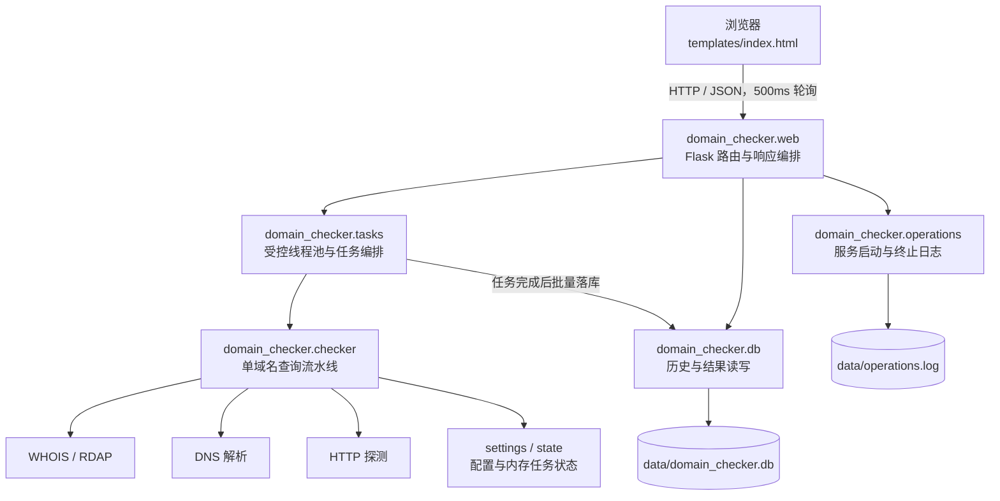
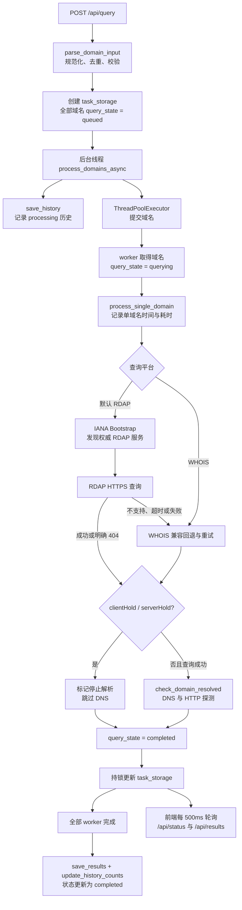
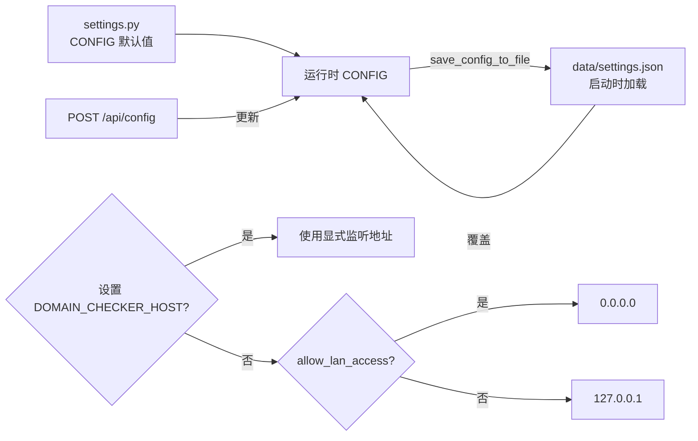

# 架构说明

本文档帮助维护者与代码助手理解系统设计、数据流与扩展点。阅读顺序建议：先总览图，再按需要深入。

## 总览

### 模块职责

| 模块 | 职责 | 关键内容 |
|------|------|----------|
| `settings.py` | 路径、全局 CONFIG、配置持久化 | `CONFIG`、`PLATFORMS`、`SERVER_RUNTIME`、settings.json 读写、环境变量 |
| `state.py` | 进程内存中的任务状态 | `task_storage`、`task_lock`、`task_pause_flags` |
| `domains.py` | 输入解析 | `parse_domain_input`、`extract_domain`、`is_valid_domain` |
| `checker.py` | 单域名查询流水线 | WHOIS 重试、DNS 解析检查、结果合并、任务实时更新 |
| `db.py` | SQLite 读写 | 历史/明细两表 CRUD，`init_db()` 幂等 |
| `tasks.py` | 批量任务编排 | 线程启动/限流间隔、暂停/继续、完成落库 |
| `export.py` | 报表导出 | `create_export_file`、CSV/XLSX，表头与状态文案集中定义 |
| `operations.py` | 服务操作日志 | `record_operation`、`get_operations`，JSON Lines 持久化 |
| `web.py` | HTTP 层 | Flask 工厂 `create_app()`、全部 API、`run_server()` |

依赖方向自上而下，无循环导入。`cli.py` 只依赖 `checker/export/settings`。

## 核心流程

### 查询任务生命周期

任务状态机：`processing → completed`；`api_cancel` 可置 `cancelled`（线程仍会自行结束当前网络请求）。
结果行状态机：`queued → querying → completed`；暂停时仅未完成行临时进入 `paused`，恢复时回到暂停前阶段；
终止时仅未完成行进入 `cancelled`，已经 `completed` 的行保持原结果。
服务重启后 `processing` 中的任务永久停滞（内存丢失）——历史里此类记录属预期异常。

### 暂停/继续/重查

- 暂停：`task_pause_flags[task_id]=True`；worker 启动、注册数据请求返回后、WHOIS/DNS 重试前、HTTP
  探测前和结果提交前均有协作式检查点。已经发出的同步网络请求无法强制中断，会在当前请求返回后停住；任务启动线程
  使用 `setdefault`，避免覆盖用户刚提交任务后立即点击的暂停请求。暂停期间未完成结果行显示“已暂停”，继续后恢复
  原来的排队或查询阶段；终止则显示“已终止”，已完成行不受影响
- 重查（retry/retry-failed）：任务重新进入 `processing`，使用同一受控线程池按"同域名覆盖、
  否则追加"更新结果，并记录独立的操作进度与耗时；任务不在内存时先从 SQLite 历史恢复
- `retry-failed` 同时包含查询失败/超时/无效结果，以及注册数据查询成功但 `resolved=None` 的 DNS 未知结果

### 查询结果状态判定

`process_single_domain` 的 `status` 取值：

| status | 含义 | 触发 |
|--------|------|------|
| `success` | RDAP 或 WHOIS 成功（无 hold 状态时进入 DNS 检查） | - |
| `not_registered` | 域名未被注册 | 权威 RDAP 404，或 WHOIS 文本/明确异常含确定性未找到结论；**立即返回不重试** |
| `timeout` | 注册数据查询超时 | RDAP 不可用且 WHOIS 套接字在 `CONFIG['timeout']` 秒内未完成，重试后仍超时 |
| `failed` | 查询最终失败 | 空响应、配额超限/解析错误/其他网络异常等，重试 `max_retries` 次后仍失败；空响应不能判定为未注册 |
| `invalid` | 输入格式非法 | `is_valid_domain` 未通过 |

注意 WHOIS 异常体系为 `WhoisDomainNotFoundError → WhoisError → PywhoisError`，
捕获顺序必须具体在前，父类在后。

子域通过 `tldextract` 内置公共后缀规则归一化为可注册主域
（`www.baidu.com → baidu.com`、`www.example.co.uk → example.co.uk`），原输入仍用于结果标识和 DNS 检查，
避免权威服务对子域返回 404 后误判未注册。默认链路先读取并缓存 24 小时的 IANA RDAP Bootstrap，
按 TLD 发现权威 RDAP 服务；TLD 未发布服务、RDAP 超时或非确定性失败时才进入 WHOIS 重试。
显式 WHOIS 平台仍保留首次失败后尝试 RDAP 的可靠性回退。两种协议的成功结果进入相同 hold 与 DNS 判定流程。

### 解析状态判定

`check_domain_resolved` 只在 RDAP/WHOIS 确认已注册后调用，因此"域名不存在"从语义上不成立：

| DNS 返回 | resolved | block_reason（面向用户的文案） |
|----------|----------|-------------------------------|
| 有 A 记录 | `True` | —（并尝试 HTTP 探测） |
| NXDOMAIN | `False` | 未解析（NXDOMAIN）：域名已注册但DNS中无解析记录，疑似已被停止解析/冻结 |
| NoAnswer | `False` | 已注册但未配置 A 记录 |
| NoNameservers | `False` | 权威DNS服务器异常 |
| Timeout | `None` | 自动复查一次后仍超时，状态未知并建议重查 |
| WHOIS `clientHold/serverHold` | `False` | 停止解析（域名被封）：注册商/注册局已暂停域名解析，不再重复发起 DNS 查询 |
| 其他异常 | `None` | 异常摘要 |

文案在前端"解析"列、运行日志与导出报表中保持一致用词：正常解析 / 未解析 / 未知。
注册数据查询成功日志不得预告 DNS 阶段；只有未检测到 hold 时才实际进入 DNS。检测到
`clientHold/serverHold` 后直接形成停止解析结论并跳过 DNS。

## 数据模型

SQLite（`query_history` + `query_results`），表结构见 `db.init_db()` 的 DDL。要点：

- `query_history.task_id` 唯一；一次任务一行，含域名清单快照与配置快照（剔除敏感项）
- `query_results` 按 `task_id` 关联；`save_results` 对同一任务整体覆盖写入
- `query_state` 是内存中的实时执行阶段，不写入 SQLite；历史结果均视为 `completed`
- 历史批量删除在同一 SQLite 事务中先删明细再删主记录；清理全部和删除运行中任务互斥
- `resolved` 存 `1/0/NULL` 对应 `True/False/None`（API 返回时注意转换）
- `whois_status` 保留 WHOIS 原始状态，`hold_status` 记录 `clientHold/serverHold`，
  `contact_email` 保存 WHOIS/RDAP 可提取的联系邮箱（RDAP 优先投诉联系人）；
  `raw_response` 保存 WHOIS 原始文本或 RDAP JSON；`query_time` 与 `query_duration_seconds` 记录
  单域名查询开始时间和完整流水线耗时
- `CONFIG['timeout']` 同时作为 WHOIS、RDAP、DNS 与 HTTP 每次网络尝试的超时（网页/API 可设为 1-120 秒）；
  它不是整批任务总时限，失败重试和 DNS 自动复查会累加整体耗时
- 时间戳均为**本地 naive ISO 格式**（`datetime.now().isoformat()`），排序按字符串比较
  在同年场景下成立；宽限历史数据不强求时区化

## 并发模型

- Flask `threaded=True`；批任务入口线程为 daemon，域名查询由 `ThreadPoolExecutor` 管理
- 实际监听进程在启动和正常退出时写 `operations.log`；debug 重载父进程不重复写启动记录
- 共享状态保护：`config_lock`（CONFIG 读写）、`task_lock`（task_storage 读写）
- 写日志/改先决步骤时注意：在 `task_lock` 内不做数据库 IO（完成落库在锁外执行）
- `task_pause_flags` 为普通 dict，布尔读写本身原子性足够
- `max_workers` 是每个任务的线程池上限；去掉了逐域名创建线程的固定启动间隔，查询内仍按
  `rate_limit_delay` 执行限流
- 查询任务支持 `unlimited`/`standard`/`quick`/`brief` 四种模式，默认 `unlimited` 不添加主动等待。
  前三种只调整 WHOIS 请求与失败重试等待；`brief` 最多执行一次 WHOIS 尝试、一次 DNS 查询，跳过 HTTP
  探测与 DNS 自动复查，因此瞬时故障更容易显示未知或失败，但不会放宽未注册判定。任务可通过
  `query_timeout` 覆盖全局单次网络请求超时。
- 任务用单调时钟累计 `paused_duration_seconds`；状态接口、任务完成耗时和单域名耗时均扣除暂停区间，
  因此暂停期间计时冻结，恢复后不会补跳。

## 配置流

`POST /api/config` 对 `allow_lan_access` 做变更检测，仅变化时在响应中提示需要重启；
同时 `GET /api/config` 返回 `server` 字段展示**实际**监听状态，供前端提示"重启后生效"。

## 扩展指南

### 接入新的查询平台（如 WHOIS XML）

当前状态：RDAP 与 WHOIS 均已实现，`whoisxml` 为 `implemented=False`。前端选择未实现平台时会显示
常驻提示与 Toast，`tasks.process_domains_async` 会在运行日志写明实际使用 WHOIS 标准协议。接入步骤：

1. 在 `checker.py` 增加 `_query_xxx_with_retry(domain)`，返回结构对齐
   `query_whois_with_retry` 的 result dict（含 `not_registered` 语义）
2. 在 `query_registration_with_retry` 按任务平台分派（保留 RDAP 默认与 WHOIS 回退）
3. `settings.PLATFORMS[key]['implemented'] = True`，并更新 `desc`
4. 前端 `templates/index.html` 中的 `platforms` 对象同步 desc/implemented（前端不读后端 PLATFORMS，
   保持两处一致）
5. 更新 README 平台表与 CHANGELOG

### 新增导出格式

1. `export.py` 增加 `create_<fmt>(results, timestamp)`，并在 `create_export_file` 分派
2. `web.api_export` 增加对应 mimetype 分支；前端格式下拉增加选项

### 新增 API 端点

在 `web._register_routes` 内就近按分组添加；逻辑下沉到相应领域模块，路由只做参数与响应。
记得在 `docs/API.md` 登记，并补一条 `tests/test_api.py` 用例。

## 已知技术债

1. 取消任务只是阻止未开始的域名、置 cancelled，不会强制中断已经进入同步 WHOIS 的线程
2. 重启后内存任务丢失，重查/进度接口 404；可考虑任务状态全量入库
3. `PUT/DELETE` 语义化的历史记录清理接口与分页查询可进一步完善

## 测试策略

- 单元测试纯函数（domains/export/db），集成测试走 Flask `test_client`（不绑端口）
- **不访问外网**：`dns.resolver.Resolver` 用 mock 构造各类异常；whois 不做集成测试
- `conftest.py` 在任何包导入前把 `DOMAIN_CHECKER_DATA_DIR` 指向临时目录，隔离真实数据
