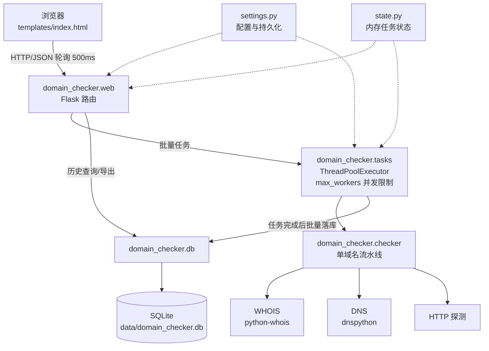
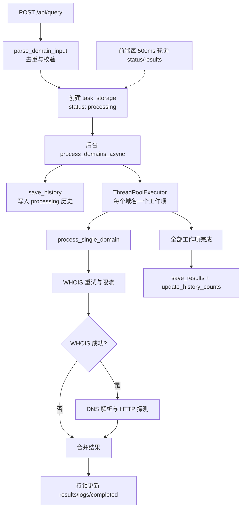
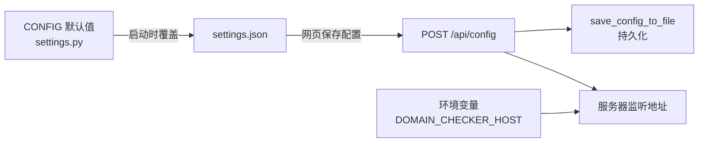

# 架构说明

本文档帮助维护者与代码助手理解系统设计、数据流与扩展点。阅读顺序建议：先总览图，再按需要深入。

## 总览

### 模块职责

| 模块 | 职责 | 关键内容 |
|------|------|----------|
| `settings.py` | 路径、全局 CONFIG、配置持久化 | `CONFIG`、`PLATFORMS`、`SERVER_RUNTIME`、settings.json 读写、环境变量 |
| `state.py` | 进程内存中的任务状态 | `task_storage`、`task_lock`、暂停/取消标志 |
| `domains.py` | 输入解析 | `parse_domain_input`、`extract_domain`、`is_valid_domain` |
| `checker.py` | 单域名查询流水线 | WHOIS 重试、DNS 解析检查、结果合并、任务实时更新 |
| `db.py` | SQLite 读写 | 历史/明细两表 CRUD，`init_db()` 幂等 |
| `tasks.py` | 批量任务编排 | 线程池并发控制、暂停/继续/取消、完成落库 |
| `export.py` | 报表导出 | `create_export_file`、CSV/XLSX，表头与状态文案集中定义 |
| `web.py` | HTTP 层 | Flask 工厂 `create_app()`、全部 API、`run_server()` |

依赖方向自上而下，无循环导入。`cli.py` 只依赖 `checker/export/settings`。

## 核心流程

### 查询任务生命周期

状态机：`processing → completed`；`api_cancel` 可置 `cancelled`（线程仍会自行跑完当前域名）。
服务重启后 `processing` 中的任务永久停滞（内存丢失）——历史里此类记录属预期异常。

### 暂停/继续/重查

- 暂停：`task_pause_flags[task_id]=True`；两处生效点：`tasks.py` 启动下一域名前、
  `checker.py` 每次重试前自旋等待
- 重查（retry/retry-failed）：对内存任务按"同域名覆盖、否则追加"的方式更新结果，
  并置 `refresh=True` 通知前端整表刷新；重查只支持内存任务（重启后不可用）

### 解析状态判定

`check_domain_resolved` 只在 WHOIS 成功后调用，因此"域名不存在"从语义上不成立：

| DNS 返回 | resolved | block_reason（面向用户的文案） |
|----------|----------|-------------------------------|
| 有 A 记录 | `True` | —（并尝试 HTTP 探测） |
| NXDOMAIN | `False` | 未解析（NXDOMAIN）：域名已注册但DNS中无解析记录，疑似已被停止解析/冻结 |
| NoAnswer | `False` | 已注册但未配置 A 记录 |
| NoNameservers | `False` | 权威DNS服务器异常 |
| Timeout | `None` | 查询超时，状态未知 |
| 其他异常 | `None` | 异常摘要 |

文案在前端"解析"列、运行日志与导出报表中保持一致用词：正常解析 / 未解析 / 未知。

## 数据模型

SQLite（`query_history` + `query_results`），表结构见 `db.init_db()` 的 DDL。要点：

- `query_history.task_id` 唯一；一次任务一行，含域名清单快照与配置快照（剔除敏感项）
- `query_results` 按 `task_id` 关联；`save_results` 对同一任务整体覆盖写入
- `resolved` 存 `1/0/NULL` 对应 `True/False/None`（API 返回时注意转换）
- 时间戳均为**本地 naive ISO 格式**（`datetime.now().isoformat()`），排序按字符串比较
  在同年场景下成立；宽限历史数据不强求时区化

## 并发模型

- Flask `threaded=True`；任务线程均为 daemon
- 共享状态保护：`config_lock`（CONFIG 读写）、`task_lock`（task_storage 读写）
- 写日志/改先决步骤时注意：在 `task_lock` 内不做数据库 IO（完成落库在锁外执行）
- `task_pause_flags` 为普通 dict，布尔读写本身原子性足够
- 批量查询通过 `ThreadPoolExecutor` 限制并发数，`max_workers` 在任务创建时读取并对非法值做边界保护
- 暂停只阻止尚未开始的工作项；取消会让尚未开始的工作项跳过执行，在途同步请求无法强制中断

## 配置流

`POST /api/config` 对 `allow_lan_access` 做变更检测，仅变化时在响应中提示需要重启；
同时 `GET /api/config` 返回 `server` 字段展示**实际**监听状态，供前端提示"重启后生效"。

## 扩展指南

### 接入新的查询平台（如真实 RDAP）

1. 在 `settings.PLATFORMS` 增加元信息
2. 在 `checker.py` 增加 `_query_rdap_with_retry(domain)`，返回结构对齐
   `query_whois_with_retry` 的 result dict
3. 在 `process_single_domain` 按 `CONFIG['platform']` 分派（保留 whois 为默认分支）
4. `settings.json`/历史快照会自动带上新平台；前端按钮会自动渲染（按 PLATFORMS 顺序除外，需加按钮）

### 新增导出格式

1. `export.py` 增加 `create_<fmt>(results, timestamp)`，并在 `create_export_file` 分派
2. `web.api_export` 增加对应 mimetype 分支；前端格式下拉增加选项

### 新增 API 端点

在 `web._register_routes` 内就近按分组添加；逻辑下沉到相应领域模块，路由只做参数与响应。
记得在 `docs/API.md` 登记，并补一条 `tests/test_api.py` 用例。

## 已知技术债

1. 取消任务无法强制中断已经开始的同步 WHOIS/DNS 请求，只能阻止尚未开始的工作项
2. 重启后内存任务丢失，重查/进度接口 404；可考虑任务状态全量入库
3. WHOIS 同步阻塞，`timeout` 配置未真正作用于 whois 调用（底层 socket 超时）
4. `PUT/DELETE` 语义化的历史记录清理接口与分页查询可进一步完善

## 测试策略

- 单元测试纯函数（domains/export/db），集成测试走 Flask `test_client`（不绑端口）
- **不访问外网**：`dns.resolver.Resolver` 用 mock 构造各类异常；whois 不做集成测试
- `conftest.py` 在任何包导入前把 `DOMAIN_CHECKER_DATA_DIR` 指向临时目录，隔离真实数据
