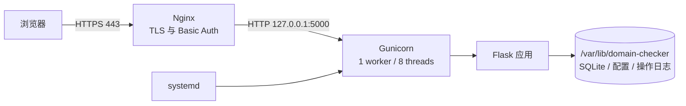

# Nginx 生产部署方案

本文给出 Ubuntu/Debian 单机部署的推荐配置：Nginx 负责公网入口、TLS 和访问认证，Gunicorn 运行 Flask
应用，systemd 负责启动、停止和故障拉起，SQLite 与运行配置保存在独立数据目录。其他 Linux 发行版可沿用
同一结构，只需替换包管理器和 Nginx 站点目录。

## 部署结构与约束



必须保持 **一个 Gunicorn worker 和单个应用实例**。当前任务状态、暂停标志和实时日志保存在 Python
进程内存中；多个 worker、多个容器或负载均衡到多台应用服务器会导致轮询请求读到另一份内存，表现为
“任务不存在”或进度不一致。并发查询由应用内部线程池负责，HTTP 并发由 Gunicorn `gthread` 线程处理。

应用本身没有账号与权限系统。服务器暴露到公网时，至少启用模板中的 Nginx Basic Auth；更严格的环境应
通过 VPN、零信任网关或来源 IP 白名单限制访问。

## Python 环境选择

本项目推荐 **uv + 项目内 `.venv`**，不推荐仅为部署本项目安装 Miniforge：

| 方案 | 是否推荐 | 适用场景 |
|------|----------|----------|
| uv + `.venv` | 推荐 | 本项目的 Flask、DNS、SQLite 和 Gunicorn 均来自常规 Python/PyPI 生态；安装快，可用 `uv.lock` 复现依赖 |
| `python -m venv` + pip | 可用 | 不希望服务器增加 uv，或已有成熟的 pip 部署流程 |
| Miniforge/Conda | 通常不需要 | 同机项目依赖 CUDA、MKL、GDAL 等 Conda 二进制包，或组织已统一使用 Conda |

不要在同一部署中混用 uv 环境、Conda 环境和系统 pip。systemd 直接执行
`/opt/domain-checker/.venv/bin/gunicorn`，运行时不会调用 `uv run`，因此不会在服务启动时修改环境或联网解析依赖。
仓库提交了 `uv.lock`，生产同步使用 `--frozen`；依赖声明与锁文件不一致时直接失败，避免静默安装另一组版本。

## 1. 安装系统组件

以下命令以具有 `sudo` 权限的普通用户执行：

```bash
sudo apt update
sudo apt install -y curl git python3 nginx apache2-utils certbot python3-certbot-nginx
curl -LsSf https://astral.sh/uv/install.sh | sudo env UV_INSTALL_DIR=/usr/local/bin UV_NO_MODIFY_PATH=1 sh
uv --version
```

创建不可登录的服务账号、代码目录和持久化数据目录：

```bash
sudo useradd --system --user-group --home /var/lib/domain-checker --shell /usr/sbin/nologin domain-checker
sudo git clone https://github.com/xuchaoxin1375/domain-checker.git /opt/domain-checker
cd /opt/domain-checker
sudo /usr/local/bin/uv sync --extra prod --no-dev --frozen --python /usr/bin/python3
sudo install -d -o domain-checker -g domain-checker -m 750 /var/lib/domain-checker
```

系统 Python 必须满足项目的 Python 3.10+ 要求。需要用传统 venv 时，将 `uv sync` 替换为：

```bash
sudo apt install -y python3-venv
sudo python3 -m venv /opt/domain-checker/.venv
sudo /opt/domain-checker/.venv/bin/pip install --upgrade pip
sudo /opt/domain-checker/.venv/bin/pip install -r /opt/domain-checker/requirements.txt gunicorn
```

代码和虚拟环境保持由 `root` 管理，服务账号只需读取它们；只有 `/var/lib/domain-checker` 可写。不要把现有
`data/domain_checker.db` 覆盖掉。迁移已有数据时，应先停服务，再复制数据库、`settings.json` 和
`operations.log`，最后把所有者改为 `domain-checker:domain-checker`。

## 2. 配置应用与 systemd

安装环境变量和服务单元：

```bash
sudo cp /opt/domain-checker/deploy/domain-checker.env.example /etc/domain-checker.env
sudo chmod 640 /etc/domain-checker.env
sudo cp /opt/domain-checker/deploy/domain-checker.service /etc/systemd/system/domain-checker.service
sudo systemctl daemon-reload
sudo systemctl enable --now domain-checker
```

确认应用只监听本机回环地址：

```bash
sudo systemctl status domain-checker --no-pager
curl -I http://127.0.0.1:5000/
ss -ltnp 'sport = :5000'
```

`DOMAIN_CHECKER_HOST=127.0.0.1` 是生产部署的安全边界，不要改成 `0.0.0.0`。Gunicorn 的 180 秒是
HTTP 请求上限，不是页面中“单次查询超时”；域名查询在后台线程执行，页面通过短请求轮询进度。

常用管理命令分开执行：

```bash
sudo systemctl start domain-checker
```

```bash
sudo systemctl stop domain-checker
```

```bash
sudo systemctl restart domain-checker
```

```bash
sudo journalctl -u domain-checker -f
```

## 3. 配置 Nginx 与访问认证

把模板中的 `checker.example.com` 替换为已解析到服务器公网 IP 的真实域名：

```bash
sudo cp /opt/domain-checker/deploy/nginx-domain-checker.conf /etc/nginx/sites-available/domain-checker
sudo sed -i 's/checker.example.com/你的域名/g' /etc/nginx/sites-available/domain-checker
sudo htpasswd -c /etc/nginx/.htpasswd-domain-checker admin
sudo ln -s /etc/nginx/sites-available/domain-checker /etc/nginx/sites-enabled/domain-checker
sudo nginx -t
sudo systemctl reload nginx
```

不要在脚本中直接写 Basic Auth 密码；`htpasswd` 会交互式读取并保存散列。以后添加用户时去掉 `-c`，
否则会覆盖原文件：

```bash
sudo htpasswd /etc/nginx/.htpasswd-domain-checker another-user
```

如果发行版没有 `sites-available/sites-enabled`，将 `server` 配置放入
`/etc/nginx/conf.d/domain-checker.conf`。Nginx 模板转发原始 Host、客户端地址和协议，并把请求体限制为 2 MB。

### 宝塔面板中的 Nginx

宝塔用户建议让面板只管理 Nginx 站点、域名和证书，Gunicorn 仍由上述 systemd 服务管理。不要同时在
宝塔“Python 项目”与 systemd 中启动应用，否则会产生两个实例、端口冲突和两份内存任务状态。

1. 在“网站”中建立站点并绑定域名，不需要 PHP。
2. 在站点“反向代理”中添加整站代理，目标 URL 填 `http://127.0.0.1:5000`，发送域名使用原始请求域名，
   内容替换留空。
3. 不要把 [`../deploy/nginx-domain-checker.conf`](../deploy/nginx-domain-checker.conf) 整个复制进宝塔站点配置；
   面板已经生成了 `server`、监听端口和证书配置，只补充反向代理 `location` 中缺少的请求头与超时参数。
4. 在面板防火墙和云安全组中不要开放 5000；先用服务器本机 `curl http://127.0.0.1:5000/` 验证后端。
5. 确认 HTTP 代理正常后，再在站点 SSL 页面申请证书并开启强制 HTTPS。
6. 每次通过面板修改反向代理后重新检查自定义配置。面板可能重写生成的站点文件，修改前先备份，并使用
   面板的配置检测确认 Nginx 语法正确。

宝塔官方文档特别说明：启用反向代理后，对应路径的面板“访问限制”规则可能失效。因此不要只依赖该开关
保护本应用；应把 `auth_basic`/`auth_basic_user_file` 写入实际生效的代理 `location /`，或者在外层使用
VPN、零信任访问网关。启用 Basic Auth 后，未带凭据的站点监控返回 `401` 属于正常现象。

宝塔反向代理的高级配置应至少保留以下内容，具体外层结构以面板生成结果为准：

```nginx
location / {
    auth_basic "Domain Checker";
    auth_basic_user_file /www/server/nginx/conf/.htpasswd-domain-checker;

    proxy_pass http://127.0.0.1:5000;
    proxy_http_version 1.1;
    proxy_set_header Host $host;
    proxy_set_header X-Real-IP $remote_addr;
    proxy_set_header X-Forwarded-For $proxy_add_x_forwarded_for;
    proxy_set_header X-Forwarded-Proto $scheme;
    proxy_connect_timeout 5s;
    proxy_send_timeout 180s;
    proxy_read_timeout 180s;
}
```

应用使用普通 HTTP 轮询，不需要开启 WebSocket。若站点前还有 CDN，应关闭 `/api/` 的缓存；否则状态与
查询结果可能被缓存成旧响应。宝塔的网站日志只覆盖 Nginx 请求，Python 运行异常仍查看
`journalctl -u domain-checker`。

## 4. 启用 HTTPS

确认域名解析正确、80/443 端口可达后申请证书：

```bash
sudo certbot --nginx -d 你的域名 --redirect
```

验证证书自动续期：

```bash
sudo certbot renew --dry-run
```

防火墙只开放 SSH、HTTP 和 HTTPS，不开放 5000：

```bash
sudo ufw allow OpenSSH
sudo ufw allow 'Nginx Full'
sudo ufw enable
```

服务器还需要出站访问 DNS（UDP/TCP 53）、RDAP（TCP 443）和 WHOIS（TCP 43）。云平台同时配置安全组，
入站仅允许 22、80、443，按管理来源进一步收紧 22。

## 5. 验收

```bash
curl -I http://127.0.0.1:5000/
curl -I https://你的域名/
sudo nginx -t
sudo systemctl is-active domain-checker nginx
```

浏览器登录后提交少量域名，确认查询结果、暂停/恢复、历史记录和导出均正常。随后检查：

```bash
sudo journalctl -u domain-checker --since '10 minutes ago' --no-pager
sudo tail -n 50 /var/log/nginx/domain-checker.error.log
```

网页“操作日志”会通过 Gunicorn hooks 记录 worker 的启动和正常终止。服务器断电、`SIGKILL` 或进程崩溃
时，最后一条终止记录不保证写入，应以 `journalctl` 为准。

## 6. 更新、备份与回滚

更新前先等待正在运行的查询结束。任务只存在于内存中，重启服务会中止尚未完成的任务。

```bash
cd /opt/domain-checker
sudo git pull --ff-only
sudo /usr/local/bin/uv sync --extra prod --no-dev --frozen --python /usr/bin/python3
sudo systemctl restart domain-checker
sudo systemctl status domain-checker --no-pager
```

SQLite 备份应使用 SQLite 在线备份命令，避免直接复制正在写入的数据库：

```bash
sudo apt install -y sqlite3
sudo install -d -m 750 /var/backups/domain-checker
sudo sqlite3 /var/lib/domain-checker/domain_checker.db \
  ".backup '/var/backups/domain-checker/domain_checker-$(date +%F-%H%M%S).db'"
```

同时备份 `/var/lib/domain-checker/settings.json`。部署前记录当前提交 `git rev-parse HEAD`；需要回滚时切回
经过验证的提交、重新安装依赖并重启。不要用回滚操作覆盖或删除 `/var/lib/domain-checker`。

## 故障排查顺序

1. `systemctl status domain-checker`：确认 Gunicorn 是否运行。
2. `curl http://127.0.0.1:5000/`：绕开 Nginx 检查应用。
3. `nginx -t` 与 Nginx 错误日志：检查代理、域名和证书配置。
4. `journalctl -u domain-checker`：检查 Python 导入、目录权限和运行异常。
5. `namei -l /var/lib/domain-checker/domain_checker.db`：检查数据目录每一级权限。

出现 `502 Bad Gateway` 时通常是 Gunicorn 未启动、监听地址不一致或 systemd 权限错误。公网可访问但查询失败
时，再检查服务器的出站 DNS、443 和 43 端口策略。更通用的端口排查与停止方法见
[`OPERATIONS.md`](OPERATIONS.md)。
